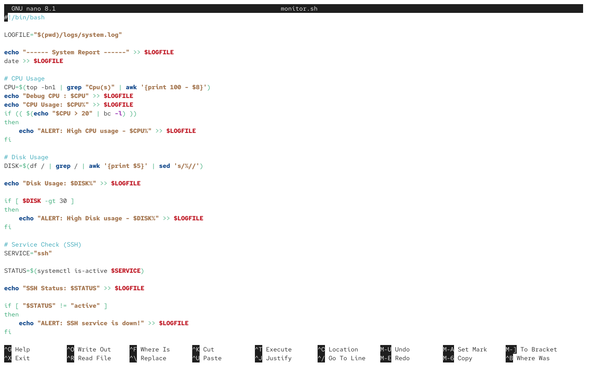
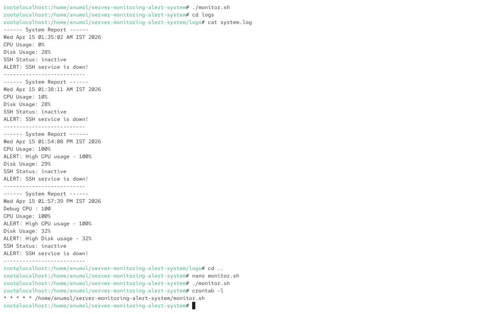

## 🚀 Server Monitoring & Alert System (DevOps Project)
🚀 A lightweight DevOps monitoring system built using Bash scripting and cron automation.
## 📌 Overview
This project is a shell script-based monitoring system that tracks server health and generates alerts when thresholds are exceeded.

## ⚙️ Features
- Monitor CPU usage
- Monitor Disk usage
- Check service status (SSH)
- Generate alerts when limits are crossed
- Automated execution using cron jobs
- Logs stored for analysis

## 🧠 Skills Demonstrated
- Linux system monitoring
- Shell scripting (Bash)
- Cron job automation
- Log analysis and alerting
- Debugging and performance testing

## 🧑‍💻 How It Works
1. Script collects system metrics (CPU, disk, service status)
2. Compares with predefined thresholds
3. Logs output into a file
4. Generates alerts if thresholds exceed
5. Cron job runs script automatically every minute

## 📸 Screenshots

### Script Output


### Logs with Alerts


## ▶️ Setup Instructions
```bash
chmod +x monitor.sh
crontab -e
* * * * * /home/anumol/server-monitoring-alert-system/monitor.sh

📊 Sample Output
------ System Report ------
CPU Usage: 85%
ALERT: High CPU usage - 85%
Disk Usage: 78%
SSH Status: active
--------------------------

🎯 Use Case

## 🎯 Use Case
This project demonstrates a basic server monitoring system similar to real-world tools like Nagios or Prometheus, focusing on CPU, disk usage, and service health monitoring with automated alerting.

🚀 Future Improvements
Email alerts
Telegram alerts
Dashboard visualization
